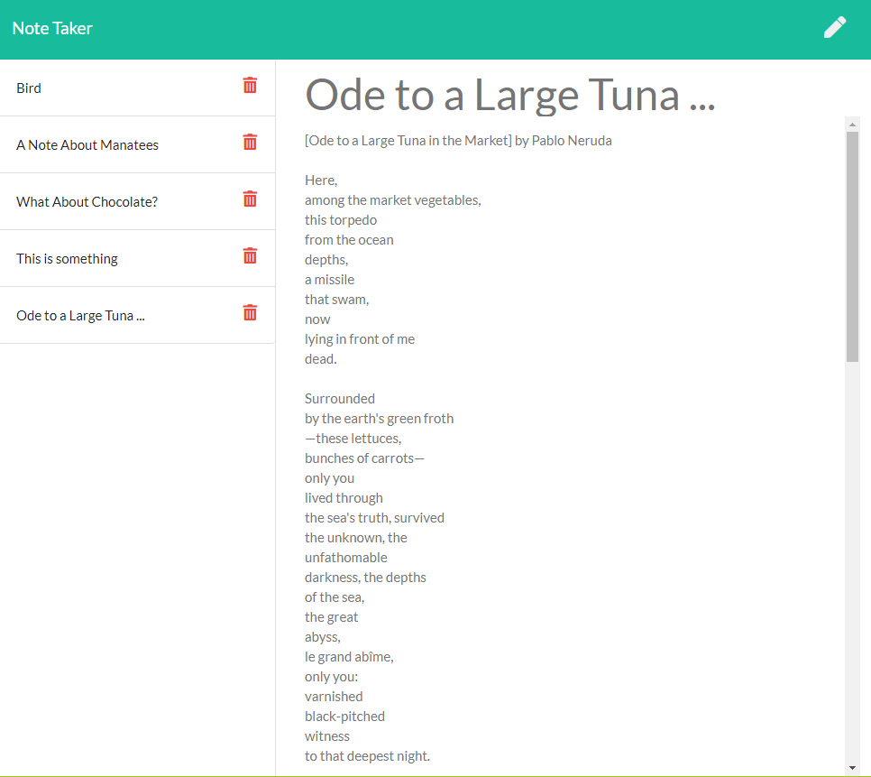

# Note Taker
[](https://opensource.org/licenses/MIT)

## Description
write and save simple text notes, with titles.

## Table of Contents
* [Installation](#Installation)
* [Usage](#Usage)
* [Contributing](#Contributing)
* [Tests](#Tests)
* [Questions](#Questions)
* [License](#License)

screenshot.png


## Installing
- run ```git clone``` to make a local copy of the project
- run ```npm install``` to install packages

*A demo db.json file has been included, with sample notes. You can clear the file or delete it. If it's deleted, it will automatically be recreated when you save your first note.*

## Usage
run ```node server.js``` (or ```nodemon server.js```) to run the app. Enter a title for your note, and any text you want for the note "body". You will not be able to save a note until the title has at least one (1) character. You do not need to enter any text in the "body". To save, click the save icon in the header nav on the right. The pencil will open a new note. Clicking on the the title of a previously saved note will display the note - which will be editable - in the note area on the right. Click the red trash icon to delete the corresponding note.

### Contributing
You're welcome to fork, clone, or even send pull requests. **NOT MONITORED** This is a homework assignment, and won't be monitored closely.

### Tests
no tests included.

### Deployment
[Live On Heroku](https://evening-falls-52980.herokuapp.com/)

### Questions
- Find me on Github: [skelliebunnie](https://github.com/skelliebunnie)
- Email me at: skelliebunnie@gmail.com

### License
Copyright (C) 2021 Angel

https://opensource.org/licenses/MIT

Permission is hereby granted, free of charge, to any person obtaining a copy of this software and associated documentation files (the "Software"), to deal in the Software without restriction, including without limitation the rights to use, copy, modify, merge, publish, distribute, sublicense, and/or sell copies of the Software, and to permit persons to whom the Software is furnished to do so, subject to the following conditions:

The above copyright notice and this permission notice shall be included in all copies or substantial portions of the Software.

THE SOFTWARE IS PROVIDED "AS IS", WITHOUT WARRANTY OF ANY KIND, EXPRESS OR IMPLIED, INCLUDING BUT NOT LIMITED TO THE WARRANTIES OF MERCHANTABILITY, FITNESS FOR A PARTICULAR PURPOSE AND NONINFRINGEMENT. IN NO EVENT SHALL THE AUTHORS OR COPYRIGHT HOLDERS BE LIABLE FOR ANY CLAIM, DAMAGES OR OTHER LIABILITY, WHETHER IN AN ACTION OF CONTRACT, TORT OR OTHERWISE, ARISING FROM, OUT OF OR IN CONNECTION WITH THE SOFTWARE OR THE USE OR OTHER DEALINGS IN THE SOFTWARE.
